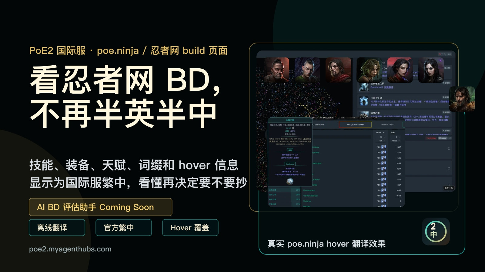
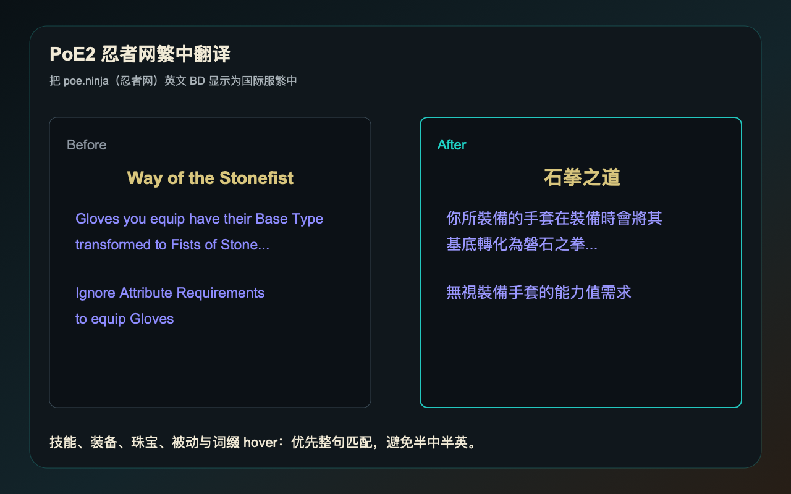
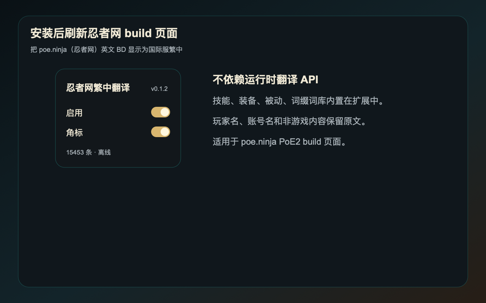
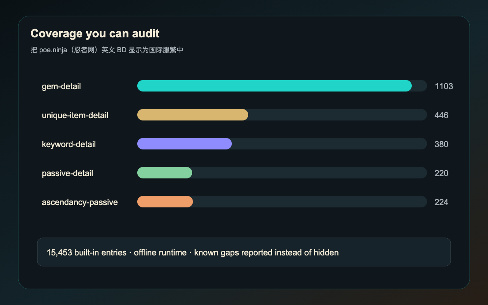

# PoE2 忍者网繁中翻译

给中文玩家用的 poe.ninja / 忍者网 PoE2 build 页面繁中工具。

它会把技能、辅助、装备、词缀、天赋、关键天赋和 hover 信息尽量显示成国际服繁中，方便国际服玩家先看懂 BD，再决定要不要抄。

官网与下载：<https://poe2.myagenthubs.com/>

## 支持范围

- poe.ninja PoE2 build 列表与角色详情页
- 职业、升华、技能、辅助宝石
- 装备、词缀、天赋、关键天赋
- hover 弹窗中的技能与装备说明
- `.build` 下载时自定义游戏内 BD 名称

插件本地运行，不依赖在线翻译 API。玩家名、账号名和非游戏内容默认保留原文。

## 下载安装

请从官网下载安装：

<https://poe2.myagenthubs.com/#download>

Chrome / Edge 商店不可访问时，官网提供离线安装包和安装步骤。Firefox / Chrome 商店版审核进度也会在官网更新。

## 效果截图

## 反馈翻译问题

发现技能、装备、天赋、词缀或 hover 仍有英文时，欢迎提交反馈：

- 官网反馈表：<https://poe2.myagenthubs.com/#feedback>
- GitHub Issues：<https://github.com/MyAgentHubs/poe2-ninja-tw/issues>

最好附上 poe.ninja build 链接、截图和具体没有翻译好的文字。

## AI BD 评估计划

后续会继续探索 AI BD 评估助手，目标是帮助玩家分析一个 BD 的伤害、生存、蓝耗、手感、造价和成型路径。

当前阶段优先把 poe.ninja 的繁中阅读体验和翻译覆盖做好。

欢迎在 Discussions 里写下你希望 AI BD 助手解决的问题：

<https://github.com/MyAgentHubs/poe2-ninja-tw/discussions>

## 隐私

插件不会上传你的 poe.ninja 账号、角色名、浏览历史或页面内容。

隐私说明：<https://poe2.myagenthubs.com/privacy>

## 关于这个仓库

这是 PoE2 忍者网繁中翻译的公开展示与反馈仓库，用于放置说明、截图、反馈模板和更新记录。

正式下载请以官网为准。

## 免责声明

这是非官方玩家工具，用于改善中文玩家查看 poe.ninja PoE2 build 的体验。Path of Exile 2、poe.ninja 和 Poe2DB 的商标、内容和数据归各自权利方所有。

联系：game@myagenthubs.com
